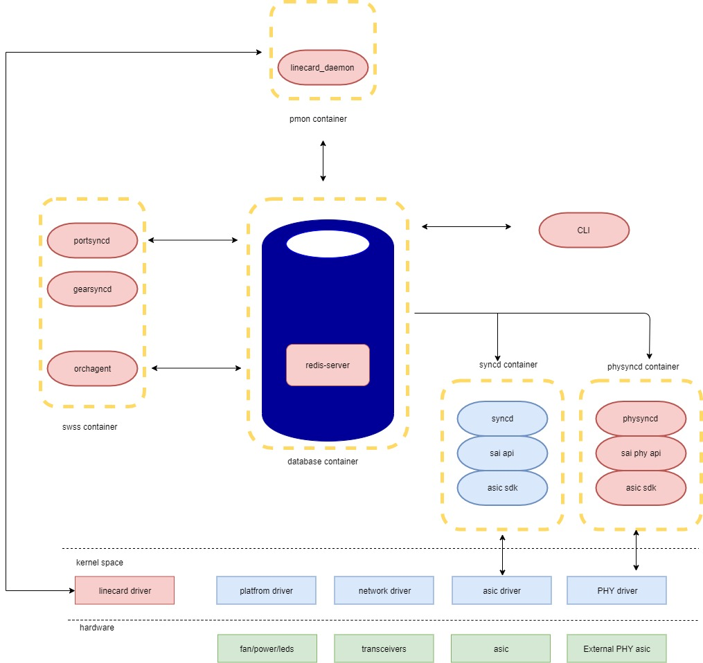
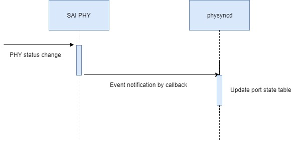
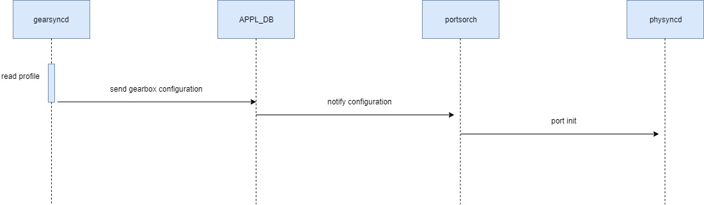
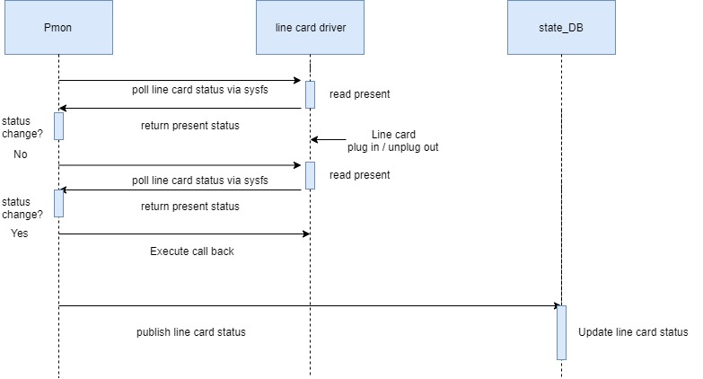
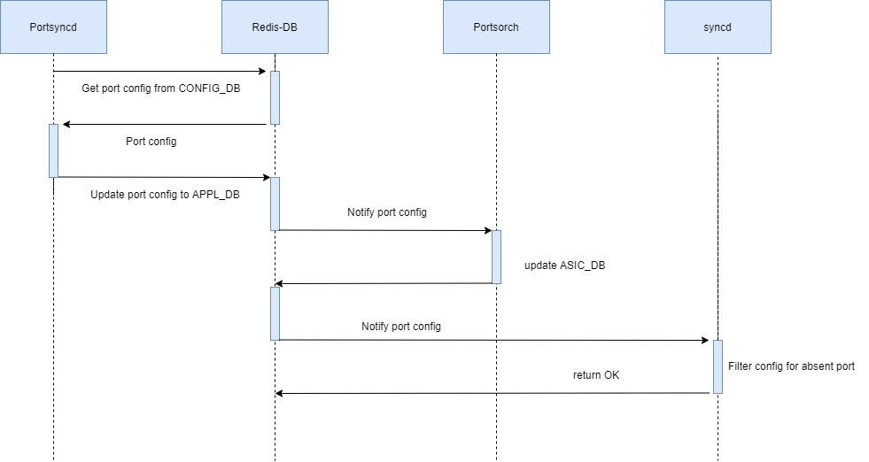

# SONiC Line Card Hot Swap

## High Level Design document

## Table of contents
[About this manual](#about-this-manual)  
[Revision](#revision)  
[Abbreviation](#abbreviation)  
[List of figures](#list-of-figures)  
* [1 Introduction and Scope](#introduction)  
* [2 Requirements](#requirements)  
    * [2.1 Functional Requirements](#functionality)  
    * [2.2 Configuration and Management Requirements](#configuration-and-management)  
* [3 Design](#design)  
    * [3.1 Architecture](#architecture)  
    * [3.2 OrchAgent Changes](#orchagent-changes) 
    * [3.3 Syncd Changes](#syncd-changes) 
    * [3.4 DB Changes](#db-changes)  
        * [3.4.1 State DB](#state-db)
    * [3.5 SAI PHY](#sai)  
    * [3.6 PMON](#pmon)
    * [3.7 CLI](#cli)
* [4 Flows](#flows)  
    * [4.1 Initialization](#initialization)  
        * [4.1.1 Event Callback Registration](#event-callback)
        * [4.1.2 Port State Table](#port-state-table)
        * [4.1.3 Port initialize](#port-initialize)
    * [4.2 Line Card Hot Event Notification](#notification)  
    * [4.3 Re-apply Configuration on Line Card](#reapply)  
* [5 Serviceability and Debug](#serviceability)
* [6 Warm Boot Support](#warm-boot)
* [7 Scalability](#scalability)
* [8 Tests](#tests)  
    * [8.1 Unit tests](#unit-test)  
* [9 Unsupported features](#unsupported)

## About this manual<a name="about-this-manual"></a>
This document describes the software high-level design of line card hot swapping implementation in SONiC.

## Revision<a name="revision"></a>

| Rev | Date       | Author         | Description                        |
|:---:|:----------:|:--------------:|:-----------------------------------|
| 0.1 | 05/02/2020 | Fish, Steve    | Initial version                    |
| 0.2 | 24/02/2020 | Fish, Steve    | Integrate with Gearbox architecture|

## Abbreviation<a name="abbreviation"></a>

|Term	   |Meaning                                                       |
|:--------:|:------------------------------------------------------------:|
|PHY	   |Physical layer                                                |
|DB        |Date base                                                     |
|CLI       |Command-Line Interface                                        |
|IPC	   |Inter Process communication                                   |
|line card |A swappable cage which consists of at least one external PHYs |

## List of figures<a name="list-of-figures"></a>
[Figure 1: Line Card Hot Swap High Level Architecture](./Arch.jpg)  
[Figure 2: State table update](./state_update.jpg
[Figure 3: PHY Initialization](./init.jpg)
[Figure 4: Line Card Event Notification](./linecard_status_change.jpg)
[Figure 5: [Reconfiguration Flow](./reconfiguration.jpg)

## 1 Introduction and Scope<a name="introduction"></a>

A modern network switch in data center must be a high fault tolerance equipment which consists of many swappable hardware components (e.g., PSU/FAN/QSFP). 
For stability, it is not allowed to reboot the device after hot-swapping hardware components. The swappable design is very important for data center to minimize the impact of failures on certain hardware components on the switch. 
This HLD provides a generic software mechanism of line card hot swapping, which includes the architecture, functional flow and CLI command.

## 2 Requirements<a name="requirements"></a>

### 2.1 Functional Requirements<a name="functionality"></a>

**This feature will support the following functionality:**
1.	A chassis consists of swappable line cards module.
2.	Each line card consists of at least one external PHY ASIC. The external PHYs on line card must be the same.
3.	Each line card can be
    *   plug in
    *	unplug out
4.	Plug in
    *	Event log with card index.
    *	Automatically apply the configuration for external PHY on line card
5.	Unplug out
    *	Event log with card index.
    *	Both system side and line side are link down.
    *	User still can configure the port, but the configuration will not take effect until the line card is plugged in again.
    *	This unplug-out event should not impact all other line cards' traffic.


### 2.2 Configuration and Management Requirements<a name="configuration-and-management"></a>

Provide CLI commands to display line card status.

## 3 Design<a name="design"></a>

### 3.1 Architecture<a name="architecture"></a>
The architecture and module dependency are shown in the following figure.



###### Figure 1: Line Card Hot Swap High Level Architecture

Figure 1 shows the integration of line card hot swap design and Gearbox architecture of SONiC. PMON needs to receive the line card state change event from line card driver. The line card kernel module is in charge of detecting line card status. After boot up, this kernel module should be inserted automatically. 
In the design of Gearbox, SAI PHY always listens to External PHY change event. Although the line card consists of multiple external PHY, the event notification flow of line card and PHY are different because line card is Penetration layer between PHY and MAC.


### 3.2 OrchAgent Changes<a name="orchagent-changes"></a>

OrchAgent will register an event callback function to publish the PHY status change events to DB and PortsOrch will be responsible for processing PHY status changes events.

### 3.3 Syncd Changes<a name="syncd-changes"></a>

A new table, Port State Table, is created in syncd to record port present status. When user configure a port via SAI, syncd will check the port state in Port State Table. If the port is not present, the configuration will not be applied on that port and return SUCCESS.


## 3.4 DB Changes<a name="db-changes"></a>

### 3.4.1 State DB<a name="state-db"></a>
A new table STATE_LINE_CARD_TABLE is created in state DB to store current status of each line card.

**Table Schema**
```
;Defines schema for STATE_LINE_CARD_TABLE that stores line card status 
key                = LINE_CARD|LINECARD_SLOT_INDEX
status             = "present" / "not present" / "unknown" ; line card present status. 
```

**redis-cli example**

```
127.0.0.1:6379[6]> hgetall "LINE_CARD|3"
1) "status"
2) "present"

```
## 3.5 SAI PHY<a name="sai"></a>
Switch SAI PHY interface APIs are already defined in Gearbox proposal but there is no swappable attributes. 
The table below represents the SAI attributes which shall be extended for line card hot swap design.

###### Table 1: switch SAI attributes
| SAI attributes                                  | Line card component                                  |
|-------------------------------------------------|------------------------------------------------------|
| SAI_SWITCH_ATTR_SWAPPABLE                       | describes the external PHY is swappable or not       |

The **create_switch** SAI PHY API is used to set wheather the external PHY is swappable. 

```cpp
/**
 * @brief Create switch
 *
 * SDK initialization/connect to SDK. After the call the capability attributes should be
 * ready for retrieval via sai_get_switch_attribute(). Same Switch Object id should be
 * given for create/connect for each NPU.
 *
 * @param[out] switch_id The Switch Object ID
 * @param[in] attr_count Number of attributes
 * @param[in] attr_list Array of attributes
 *
 * @return #SAI_STATUS_SUCCESS on success, failure status code on error
 */
typedef sai_status_t (*sai_create_switch_fn)(
        _Out_ sai_object_id_t *switch_id,
        _In_ uint32_t attr_count,
        _In_ const sai_attribute_t *attr_list);

```
In SAI, **the platform provider should provide PHY and line card mapping relationship**. This mapping list can be described in platform_nos_config of Gearbox.


### 3.6 PMON<a name="pmon"></a>
In PMON container, there are lots of daemon to monitor the device. We add a daemon to monitor line card status. Device manufacturer should implement these line card class
if their device support this feature. 

```python
def _wrapper_get_linecard_change_event(timeout):
def _wrapper_get_linecard_info(line_card_index):
def _wrapper_get_linecard_presence(line_card_index):
def _wrapper_init_linecard(line_card_index):

```
### 3.7 CLI<a name="cli"></a>

**This feature will support the following commands:**
show interface status: display Line card present status and card slots number of each port.

```
admin@sonic:~$ show interface status
  Interface    Lanes   Speed    MTU          Alias    Vlan   Oper   Admin   Type    Asym PFC   Line Card Slot   Line Card Status
-----------  -------  ------  -----  -------------  ------  -----  ------  -----  ----------  ---------------  -----------------
  Ethernet1    81,82    100G   9100   hundredGigE1  routed   down      up    N/A         N/A                1            present
  Ethernet3    83,84    100G   9100   hundredGigE2  routed   down      up    N/A         N/A                1            present
  Ethernet5    85,86    100G   9100   hundredGigE3  routed   down      up    N/A         N/A                1            present
  Ethernet7    87,88    100G   9100   hundredGigE4  routed   down      up    N/A         N/A                1            present
  Ethernet9    89,90    100G   9100   hundredGigE5  routed   down      up    N/A         N/A                1            present
 Ethernet11    91,92    100G   9100   hundredGigE6  routed   down      up    N/A         N/A                1            present
 Ethernet13    93,94    100G   9100   hundredGigE7  routed   down      up    N/A         N/A                1            present
 Ethernet15    95,96    100G   9100   hundredGigE8  routed   down      up    N/A         N/A                1            present
 Ethernet17  113,114    100G   9100   hundredGigE9  routed   down      up    N/A         N/A                1            present

```

## 4 Flows<a name="flows"></a>
### 4.1 Initialization<a name="initialization"></a>
#### 4.1.1 Event Callback Registration<a name="event-callback"></a>
For notifying the SONiC system when line card state changes, we design a status change wrapper function in PMON. This function should be implemented by device manufacturer.

#### 4.1.2 Port State Table<a name="port-state-table"></a>

At initialization, phy syncd creates an empty Port State Table, and then gets phy status to store each port status into Port State Table.

When a line card is inserted or removed, phy syncd will get the event and will update the PHY status into the Port Status Table, as shown in Figure 3.




###### Figure 2: State table update

When user needs to configure a port via SAI, it will check the port status in Port State Table.  If the PHY is linkdown on system side, SAI will not configure the port and return SUCCESS to forge the successful configuration.

#### 4.1.3 Port initialize<a name="port-initialize"></a>

Port initialization follows the initail flow of Gearbox.

1.	Load ASIC SAI library  
2.	Get asic_api_initialize & asic_api_query API’s 
3.	Initialize NPU
4.	Get Default Ports Created as part of switch initialization by config file passsd.


###### Figure 3: PHY Initialization
We extend the field of the configuration file. This field describes the mapping relationship between PHY and line card slot.
```
#PHY-ID   PHY-NAME    PHY-ADDR  PHY_LIB_NAME               FIRMWARE_PATH         PHY_CONFIG_FILE    PHY_ACCESS  BUS_ID 
0         example-1   0x1000    libsai_phy_example1.so     /tmp/phyexample1.bin  phy_1_config_file  MDIO(NPU)   0 
1         example-2   0x2000    libsai_phy_example2.so     /tmp/phyexample1.bin  phy_2_config_file  I2C         1


# name    lanes alias           index speed  PHY-ID system-lanes system-lane-speed line-lanes  line-lane-speed line-card-slot
Ethernet0 1,2   hundredGigE1/1  1     100000 0      38, 39       50G               30,31,32,33 25G                          1
Ethernet1 3,4   hundredGigE1/2  1     100000 0      40, 41       50G               34,35,36,37 25G                          1
Ethernet2 5,6   hundredGigE1/3  1     100000 1      4,5          50G               0,1,2,3     25G                          2
```
### 4.2 Line Card Event Notification:<a name="notification"></a>

Figure 4 shows the notification flow of line card event. The device manufacturer need to provide the line card driver to read the line card status.
when a line card state change event is detected. pmon receives the line card change event and log the event to syslog. To notify the SONiC, pmon will execute the callback function and send a notification to database. 
The application who subscribes the database will be notified. After all the subscriber receive the notification, the notification in database will be erased.



###### Figure 4: Line Card Event Notification Flow
1.	Platform daemon polling line card event.
2.	Device manufacturer implement the function class to read present status and send the event wile status changes.
3.	pmon will publish this event to STATE_DB. All subscribers will be notified by STATE_DB.

### 4.3 Re-apply Configuration on Line Card<a name="reapply"></a>

To support hot plug-in and unplug-out, the system needs to subscribe line card event and re-apply configuration when line card status changes.

In SONiC system, the “PortsOrch” will subscribe line card change event, and doing action when port change.So portsOrch also involves the tasks of line card hot swapping.
config_db.json will contain all ports configuration, the “PortsOrch” need do “config load” action when receiving line card change event. This will trigger system to reconfigure all ports again.
The “config load” action will not affect ongoing traffic. So the Plug-in/Unplug-out action will not affect ongoing traffic.

Following chart shows the reconfiguration flow in SONiC.

1.	While Plug-in/Unplug-out line card, phy syncd will update the “Port State Table” for “Port Config Filter”.  
2.	After receiving line card event in pmon, it will execute callback function and PUBLISH the event to Redis DB.
3.	The “PortsOrch” will be notified when receiving both line card state and PHY status changes.
4.	“PortsOrch” will do “config load” while Plug-in line card again. 

The config flow will follow Figure 5 to reapply the configuration to SAI.



###### Figure 5: Reconfiguration Flow

## 5 Serviceability and Debug<a name="serviceability"></a> 

Plug in/Unplug-out event will be logged in syslog with NOTICE level

## 6 Warm Boot Support<a name="warm-boot"></a>

There is no new configuration needed for line card hot swapping, so the mechanism supports warm reboot.

## 7 Scalability<a name="scalability"></a>

Line cards may consists of different external PHY. ex: 100G PHY * 4 or 400G PHY * 1 on line card. this feature should be supported.

## 8 Tests<a name="tests"></a>

### 8.1 Unit tests<a name="unit-test"></a>
1. **Basic test**
    1.   The line card LED shall be dark when line card is not present.
    2.   The evenlog shall pop up an alert message which shows “Line card x has been plugged in” when line card plug in and presented.
    3.   The evenlog shall pop up an alert message which shows “Line card x has been plugged out” when line card unplug out.
2. **Port status test**
    1.   The port status shall be “down” and the present status shall be “not presented” when line card is not plug-in.
    2.   The port status shall be “down” and the present status shall be “presented” when line card is plug-in without any port connected.
    3.   The port status shall be “up” and the present status shall be “presented” when line card is plug-in and some port has connected.
    4.   The port status shall be “up” and the present status shall be “presented” when line card is plug-in and some port has connected with SFP/AOC/DAC module on it.
3. **Configuration test**
    1.   DUT shall allow to configure the line card interface even line card is not presented.
    2.   The configuration shall be applied without any error when the configuration has been configured before line card plug-in.
    3.   The configuration shall not be cleared after line card unplug-out. (Configure when line card is NOT presented)
    4.   The configuration shall not be cleared after line card unplug-out. (Configure when line card is presented)
4. **Traffic Forwarding test**
    1.   The traffic forwarding shall not block when line card plug-in/unplug-out. (Traffic forwarding between 2 ports in 1st and swap operating in 2nd, 3rd and 4th with L2 traffic flow)
    2.   The traffic forwarding shall not block when line card plug-in/unplug-out. (Traffic forwarding between 2 ports in 1st and swap operating in 2nd, 3rd and 4th with L3 traffic flow)

## 9 Unsupported features<a name="unsupported"></a>
The current mechanism does not consider the hot swapping between line cards with different external PHY.


